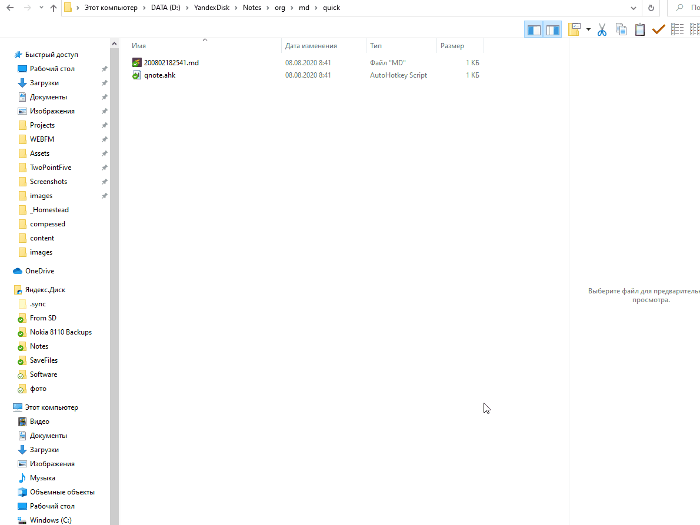

# Qnote 

AHK script for fast note creation

## Description
It adds two hotkeys. 
Popup the window in which you can set note heading and note body. 
Adds #qnote tag for the end of the note for quick searching. 

## Usage 

- `Ctrl+J` - open window
- `Ctrl+K` - close window and apply changes if text body exists

